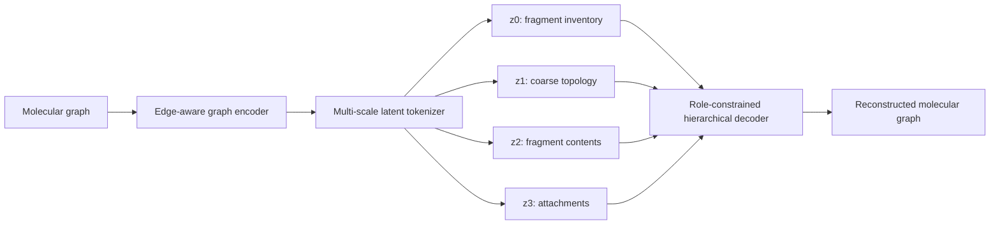

# MolMSAE

**面向分子图的多尺度表征学习与自编码建模**

Molecular Multi-Scale AutoEncoder for structured molecular representation learning.

MolMSAE 面向分子图自编码器中的潜在表征组织问题，将分子重建拆解为相互关联的多个化学尺度，并通过固定角色的潜变量分别建模片段组成、片段间拓扑、片内原子与键结构以及跨片段连接。该设计旨在减少多潜变量之间的语义纠缠，使潜空间同时具备结构重建能力、跨任务可迁移性与可分析的化学结构。

## 方法概览

传统多 Token 图自编码器通常仅约束整体重建结果，不保证各潜变量形成稳定、互补的语义分工。MolMSAE 在编码端保留集合式图表征能力，在解码端引入结构化的多尺度角色约束：

| 潜变量 | 建模尺度 | 主要信息 |
| --- | --- | --- |
| $z_0$ | 片段组成 | 片段类别、规模与成员关系 |
| $z_1$ | 粗粒度拓扑 | 片段之间的连接结构 |
| $z_2$ | 片内结构 | 原子类型与片段内部化学键 |
| $z_3$ | 跨片段连接 | 连接位点、跨片段键与局部约束 |



解码阶段采用逐层结构化路由：每一级只能直接读取其对应的连续潜变量，并通过停止梯度的离散上下文接收前序尺度信息。这样可以在保留层次依赖的同时，避免后续潜变量绕过既定角色直接复制完整分子。

## 核心模块

- **无损层次分解**：基于桥、双连通分量与环系合并，将分子图确定性分解为片段清单、粗粒度拓扑、片内结构和跨片段连接。
- **多尺度潜变量**：使用四个可学习查询从节点集合中提取固定宽度的图级表示，并为不同潜变量指定稳定的化学角色。
- **结构化分层解码**：按照“片段组成 → 片段拓扑 → 片内结构 → 跨片段连接”的顺序重建分子图。
- **潜空间诊断**：提供 Token 置换与消融、线性 CKA、有效秩、余弦相似度及 decoder Jacobian 随机投影分析。
- **严格图张量审计**：分解结果支持固定宽度图张量的无损回组装，并隔离仅用于审计的节点编号信息，防止其成为模型的信息旁路。

## 项目结构

```text
MolMSAE/
├── configs/                 # 模型与训练配置
├── scripts/                 # 潜空间分析脚本
├── src/molmsae/
│   ├── factorization.py     # 分子图多尺度无损分解
│   ├── model.py             # 编码器、潜变量与分层解码器
│   ├── data.py              # 数据接口与层次监督构造
│   ├── losses.py            # 多尺度重建目标
│   └── diagnostics.py       # 表征与敏感性诊断
├── tests/                   # 分解、路由和诊断测试
└── train.py                 # 训练入口
```

## 安装

```bash
git clone https://github.com/Eric-YHS/MolMSAE.git
cd MolMSAE
pip install -e ".[dev]"
```

## 数据格式

训练入口读取固定宽度的 NumPy 图张量归档，包含以下数组：

```text
atom_types  [num_molecules, max_nodes]
bond_types  [num_molecules, max_nodes, max_nodes]
node_mask   [num_molecules, max_nodes]
```

其中 `bond_types=0` 表示无边，邻接矩阵需保持对称，padding 节点不能与有效节点相连。层次监督由数据管线根据图结构确定性生成。

## 训练

```bash
python train.py \
  --config configs/pcqm4m32.yaml \
  --data /path/to/molecular_graphs.npz \
  --output outputs/pcqm4m32
```

## 潜空间分析

将编码结果保存为 `[samples, 4, latent_dim]` 的 NumPy 数组后，可直接生成多尺度表征统计：

```bash
python scripts/analyze_latent.py outputs/latents.npy \
  --output outputs/latent_report.json
```

报告包含联合与逐 Token 有效秩、Token 间线性 CKA 及余弦相似度矩阵，可用于分析潜变量的互补性和有效容量。

## 测试

```bash
pytest
```

测试覆盖环系、链、分支、非连通图与稀疏 padding 等分子图结构，并验证层次分解的确定性、无损回组装和解码阶段的梯度角色隔离。

